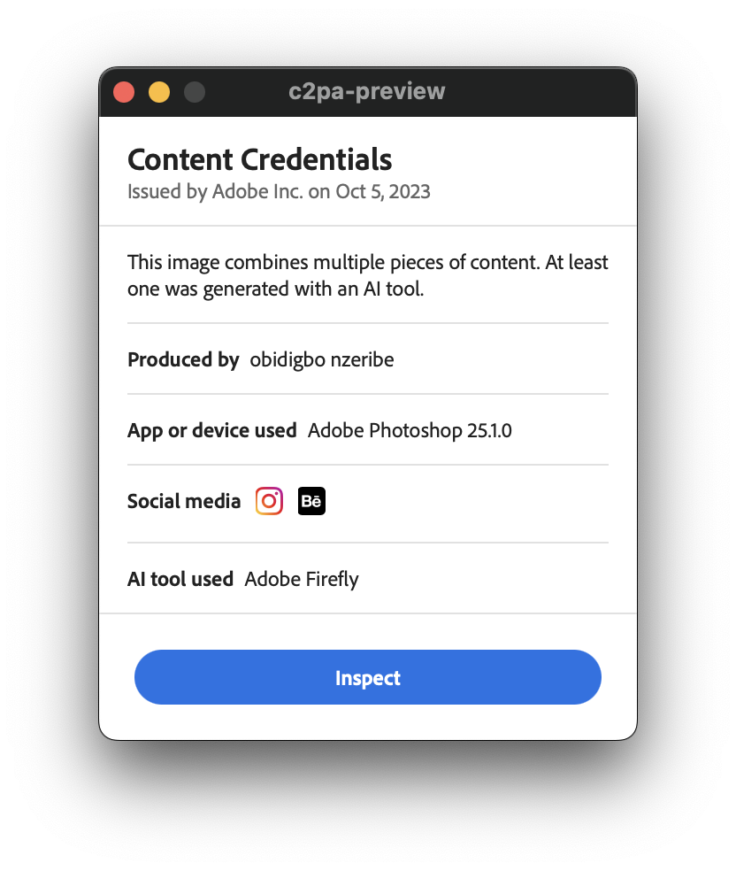

<div align="center">
  <h1><code>c2pa-preview</code></h1>
  <p>
    <a href="https://github.com/ok-nick/c2pa-preview/releases"></a>
    <a href="https://github.com/ok-nick/c2pa-preview/releases"></a>
    <a href="https://github.com/ok-nick/c2pa-preview/releases"></a>
    <br>
    <a href="https://github.com/ok-nick/c2pa-preview/actions/workflows/check-backend.yml"></a>
    <a href="https://github.com/ok-nick/c2pa-preview/actions/workflows/check-frontend.yml"></a>
  </p>
</div>

`c2pa-preview` is a desktop application to display [content credentials](https://contentcredentials.org) for the [C2PA standard](https://c2pa.org) embedded within images, videos, and other types of files. 

<div align="center">
  
  
  
</div>

## Installation
### Installing from GitHub Releases
Pre-built binaries are available for macOS, Windows, and Linux from the [GitHub Releases page](https://github.com/ok-nick/c2pa-preview/releases).

### Installing from Source
Install the prerequisites from [Tauri docs](https://v2.tauri.app/start/prerequisites/) for your platform.

Then, install frontend packages (recommended [npm](https://www.npmjs.com)):
```bash
$ npm install --prefix frontend --production
```

Next, ensure [tauri-cli](https://crates.io/crates/tauri-cli) is installed and updated:
```bash
$ cargo install tauri-cli --version "2.0.0-beta.15" --locked --force
```

Finally, build the app:
```bash
$ cargo tauri build
```

## Example Images
Download the example images below and try it for yourself! For more example images, be sure to check out [this page](https://c2pa.org/public-testfiles/image/).

<div align="center">
    
    
    
    
</div>
